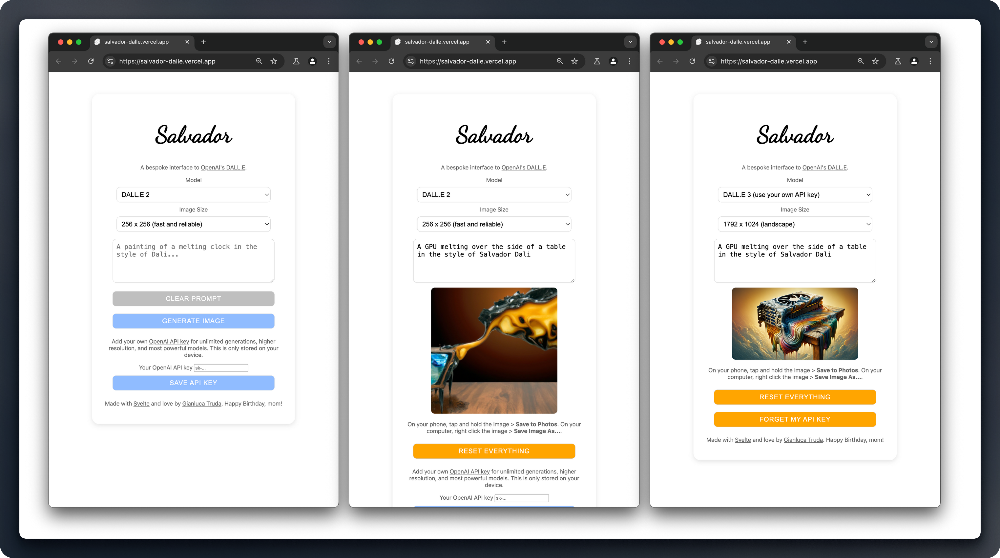

# Salvador

A clean, mobile-first interface for OpenAI’s DALL-E image generator, built with Svelte. Generate visual inspiration with AI using simple prompts and either DALL-E 2 or DALL-E 3.

- Try it at [salvador-dalle.vercel.app](https://salvador-dalle.vercel.app)
- Read about how and why I built this (plus challenges and workarounds) in my devlog: [gianluca.ai/salvador](https://gianluca.ai/salvador/)

 

## Features

- Support for both DALL·E 2 and DALL·E 3 models
- Multiple image size options
- Local storage of previous prompts
- (Optional) personal API key integration
- Mobile-first, responsive design

<center><video src="https://github.com/user-attachments/assets/9f75d219-e3f3-484b-ad80-9a16163ad720"></video></center>

## How It Works

Salvador Dalle provides a clean interface where users can:

1. Select their preferred DALL·E model (2 or 3)
2. Choose image dimensions from the supported dimensions for each model
3. Enter a text prompt (which is stored on device) to generate an image

Users can either use the application's built-in server backend (with some limitations) or provide their own OpenAI API key for unlimited and direct access to DALL.E.

## Getting Started

To run your own version of Salvador:

1. Clone this repository

```bash
git clone https://github.com/gianlucatruda/salvador.git
cd salvador
```

2. Install dependencies

```bash
npm install
```

3. Create a `.env` file in the root directory and add your OpenAI API key:

```
OPENAI_API_KEY=<sk-...>
```

4. Start the development server

```bash
npm run dev
```

5. Visit `http://localhost:5173` in your browser

## Building for Production

```bash
npm run build
```

## Technical Stack

- SvelteKit
- TypeScript
- Vite
- OpenAI API

## Environment Variables

- `OPENAI_API_KEY`: Your OpenAI API key (required for server-side operations)

## Created By

[Gianluca Truda](https://gianluca.ai)

--
